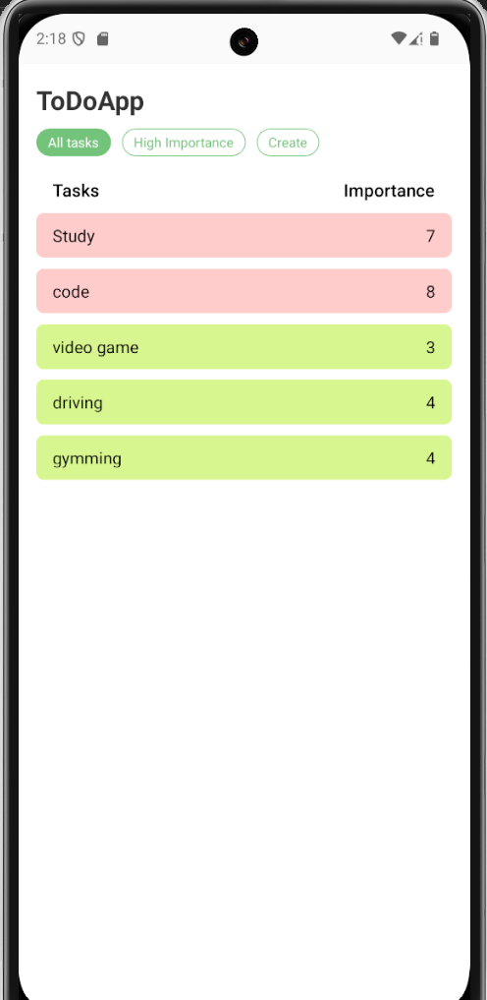
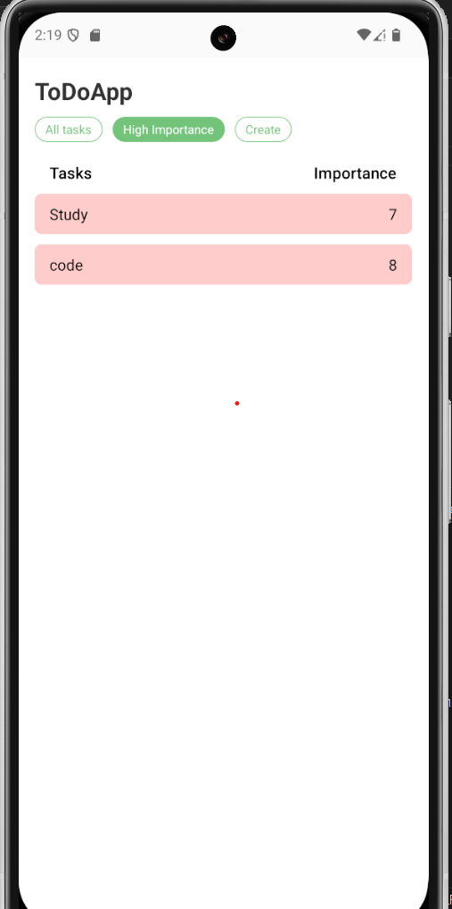
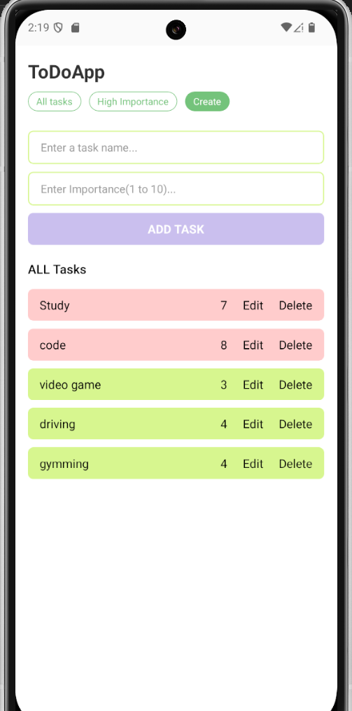
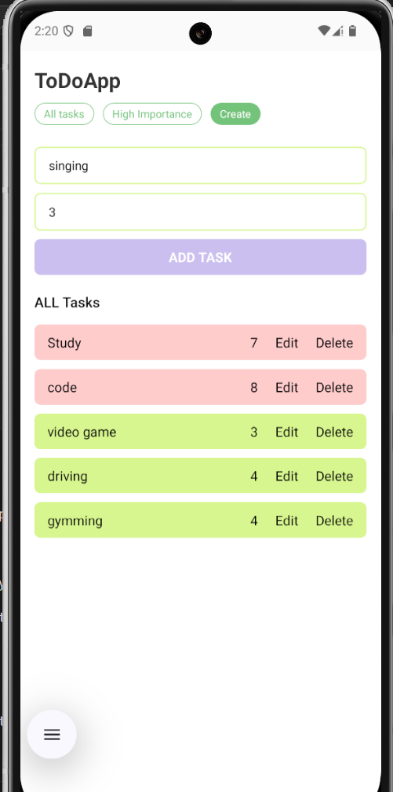
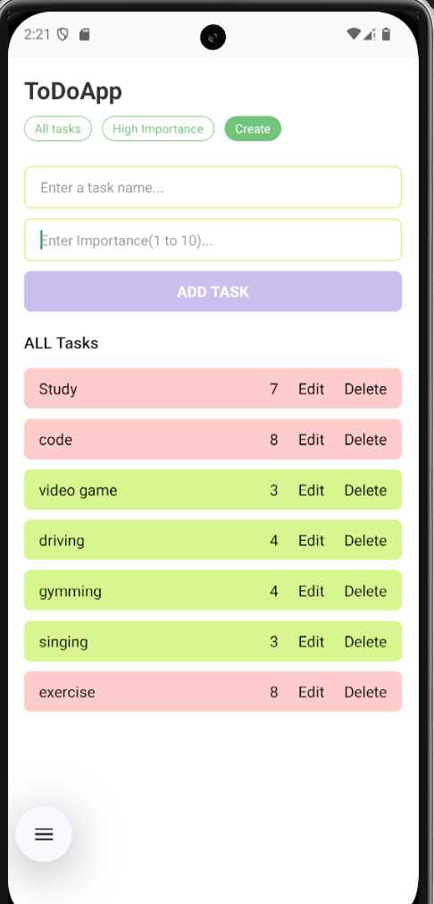
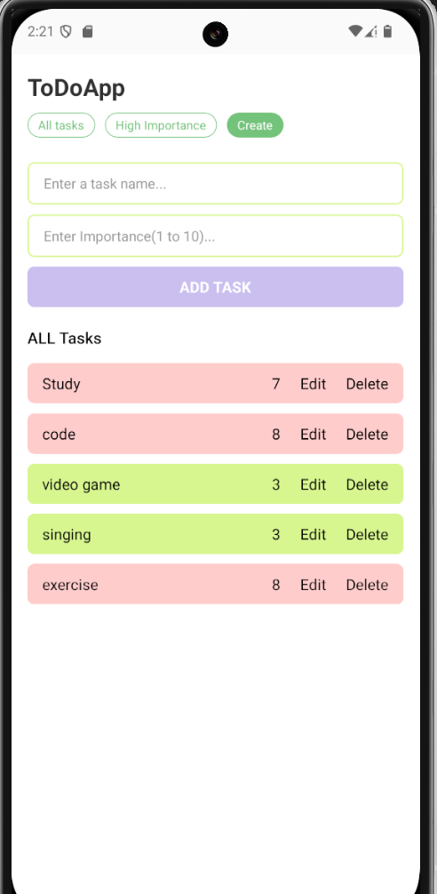
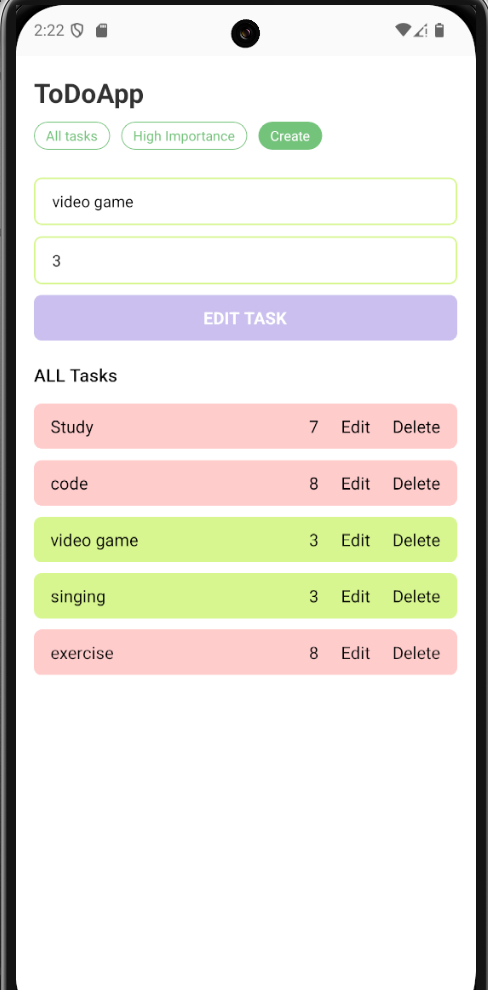
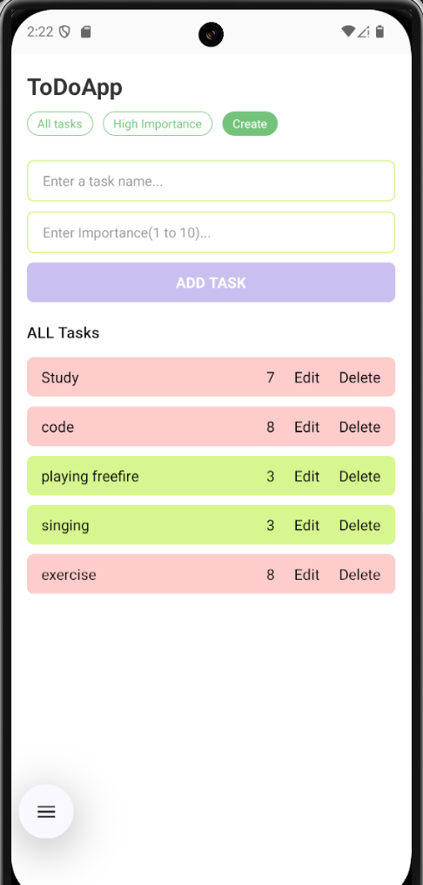

# 📝 To-Do App - React Native

A simple and clean **To-Do app** built with React Native using functional components and hooks like `useState`.

## 🚀 Features

- ✅ Add tasks with importance level (1 to 10)
- 🖍 Edit existing tasks
- 🗑 Delete tasks
- 🌈 Dynamic background color based on importance
- 📱 Built with React Native CLI

## 📸 Screenshots
## 1.All Tasks

## 2.High Importance Tasks

## 3 .Create Tasks

## 4 . Creating Task

## 5 .Task Created

## 6. Tasks Deleted 

## 7. Editing Task 

## 8 . Task Edited 

